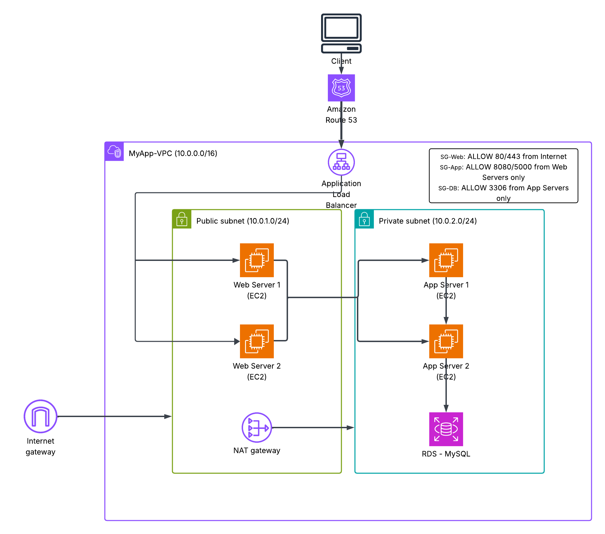

# 🏗️ AWS 3-Tier Web Architecture (Lucidchart Build Guide)

This document summarizes the process of building a **simple and scalable 3-tier web architecture** in AWS using Lucidchart.

---

## 📸 Architecture Diagram

---

## 🧱 Summary of Steps

### ✅ Step 1: Setup Lucidchart Canvas
- Open a new document in Lucidchart.
- Enable AWS Shapes under **+ More Shapes → Network / Cloud**.

### ✅ Step 2: Add VPC
- **Label**: `VPC – MyApp-VPC (10.0.0.0/16)`
- Represents an isolated virtual network for your resources.

### ✅ Step 3: Add Subnets
- **Public Subnet (10.0.1.0/24)**: Hosts internet-facing resources.
- **Private Subnet (10.0.2.0/24)**: Hosts internal app and database servers.

### ✅ Step 4: Gateways
- **Internet Gateway**: Enables internet access for the public subnet.
- **NAT Gateway**: Allows private subnet instances to access the internet without exposing them.

### ✅ Step 5: Web Layer (Public Subnet)
- **Application Load Balancer (ALB)**: Routes traffic to web servers.
- **EC2 Instances**: Web Server 1 & Web Server 2.
- **Route 53** (optional): Maps domain name to ALB.

### ✅ Step 6: App Layer (Private Subnet)
- **EC2 Instances**: App Server 1 & App Server 2.
- Process business logic, communicate with DB.

### ✅ Step 7: Database Layer (Private Subnet)
- **Amazon RDS (MySQL/PostgreSQL)**: Managed database service.

### ✅ Step 8: Security Groups (Optional)
- **SG-Web**: Allow 80/443 from the internet.
- **SG-App**: Allow 8080/5000 from web servers.
- **SG-DB**: Allow 3306 from app servers only.

---

## 🌐 Functional Overview

Each layer is isolated for **security**, **scalability**, and **availability**.

- **Web Tier**: Scalable EC2 instances behind an ALB.
- **App Tier**: Processes logic and handles backend tasks.
- **DB Tier**: Manages persistent data using Amazon RDS.

---

## 🔄 Sample Data Flow

1. User accesses `www.myapp.com`.
2. Route 53 resolves domain to ALB.
3. ALB sends request to a Web Server.
4. Web Server forwards request to an App Server.
5. App Server queries RDS.
6. Response flows back through the same path.

---

## ✅ Architecture Benefits

- **Highly Available**: Redundant instances per tier.
- **Secure**: Private subnets and strict firewall rules.
- **Scalable**: Load-balanced web servers.
- **Extendable**: Add caching, monitoring, multi-AZ easily.
